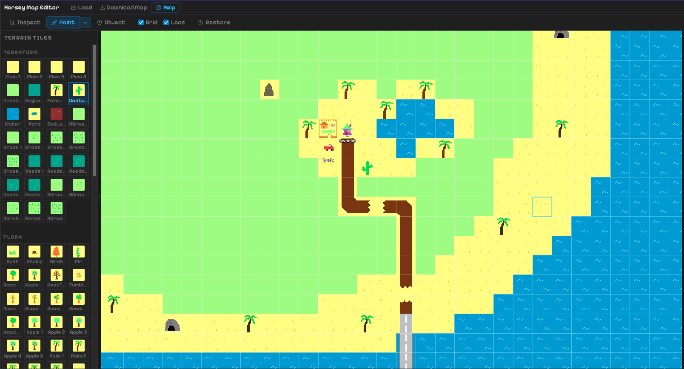
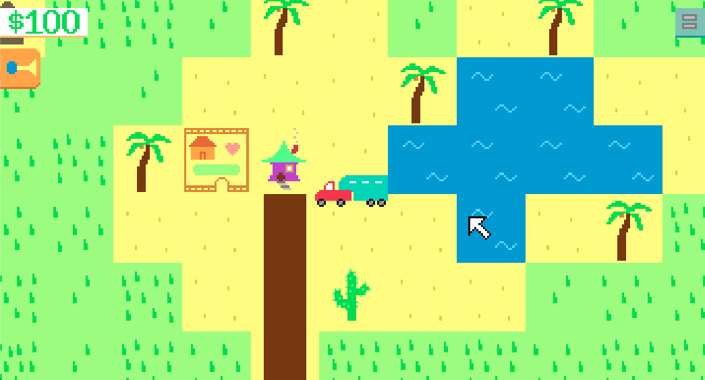
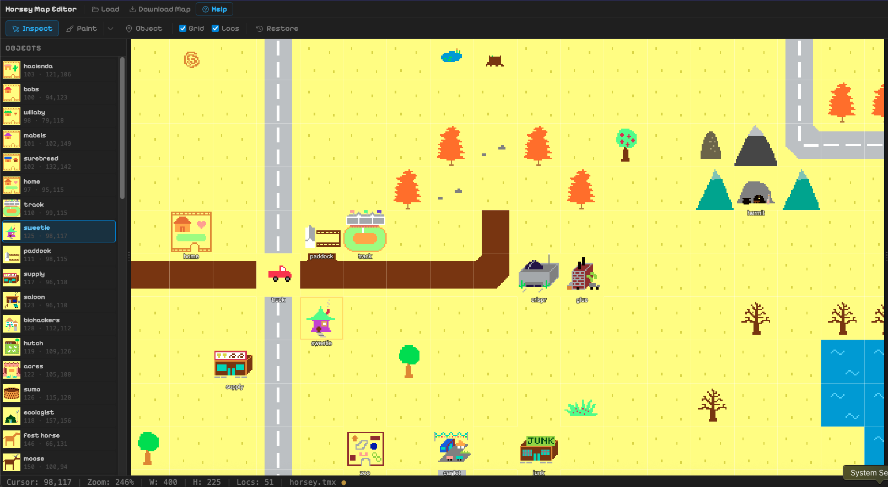
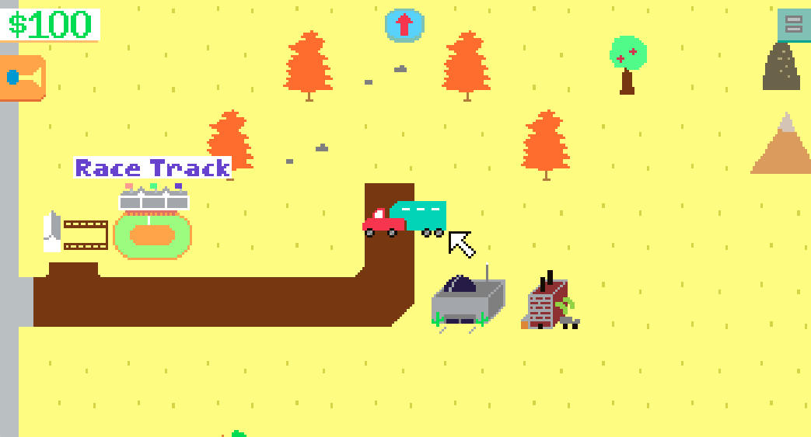
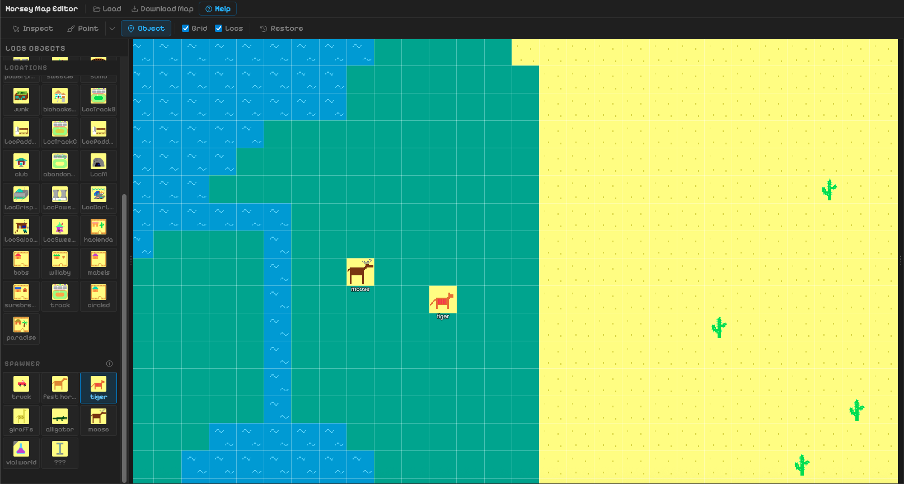
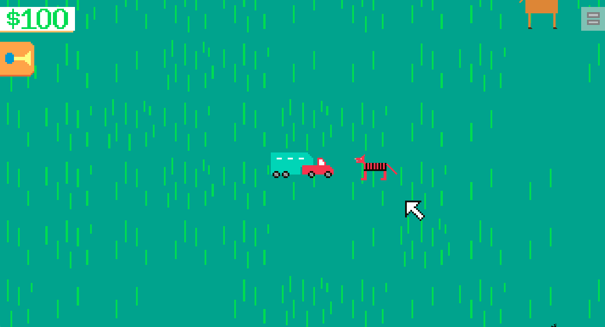

# Horsey Map Editor

An unofficial map editor for [Horsey Game](https://store.steampowered.com/app/3602570/Horsey_Game/) — runs entirely in your browser, no installation required. Select your game folder once and start editing.

> ⚠️ **Important:** Map changes are only visible when starting a **brand new save file**. Loading an existing save will not reflect your changes.

---

## Features

- **Inspect Mode** — Click and drag placed locations to reposition them;
- **Paint Mode** — Brush, Pipette, and Fill tools with adjustable size and shape; categorised tile palette
- **Object Mode** — Place or remove location and spawner objects directly on the map
- **Minimap** — Real-color minimap with live viewport indicator; resizes with the panel
- **Undo / Redo** — Full undo/redo history (Ctrl+Z / Ctrl+Y); works for tiles and objects
- **Auto Backup** — Your original map is saved automatically on first load so you can restore it any time *(manual backups still recommended)*
- **Install Instructions** — Step-by-step guide for Windows, macOS, and Linux included in the app
- **Keybinds** — All mode and tool hotkeys are rebindable from Settings

---

## Screenshots

### Terrain Painting
Paint terrain tiles using the brush, fill, or pipette. The tile palette is categorised (Terraform, Flora, Roads, etc.) for quick access.

---

### Inspect Mode — Moving Locations
Click any placed location to select it. Drag to reposition.

---

### Object Mode — Placing Spawners
Switch to Object mode to place or remove location and spawner objects. Missing required locations are highlighted and flagged automatically.

---

## Getting Started

1. Open `index.html` in your browser
2. On first launch, read and acknowledge the disclaimer to unlock the editor
3. Click **Load Game Folder** and select your Horsey Game installation directory
4. Edit your map using the three modes in the toolbar
5. When ready, click **Download Map** and follow the install instructions for your OS

> The editor needs access to `horsey.tmx`, `terrain.xml/png`, and `locs.xml/png` from your game's `Resources/` folder.

---

## Modes & Tools

| Mode | Shortcut | Description |
|------|----------|-------------|
| Inspect | `V` | Select, view, and drag objects |
| Paint | `B` | Paint terrain tiles |
| Object | `O` | Place / remove locations and spawners |

| Paint Tool | Shortcut | Description |
|------------|----------|-------------|
| Brush | `B` | Click or drag to paint |
| Pipette | `P` | Pick tile under cursor |
| Fill | `G` | Flood-fill a contiguous region |

> Right-click the canvas in Paint mode to adjust brush size and shape.

---

## ⚠️ Disclaimer

This tool does **not** store, edit, distribute, or otherwise handle any game assets outside of your local machine. It reads assets exclusively from the game folder you select at runtime, uses them only for display purposes within the editor, and writes only to the single `.tmx` file you choose to download. No data is uploaded or transmitted anywhere.

This is an unofficial fan-made tool and is not affiliated with or endorsed by Captain Games.
